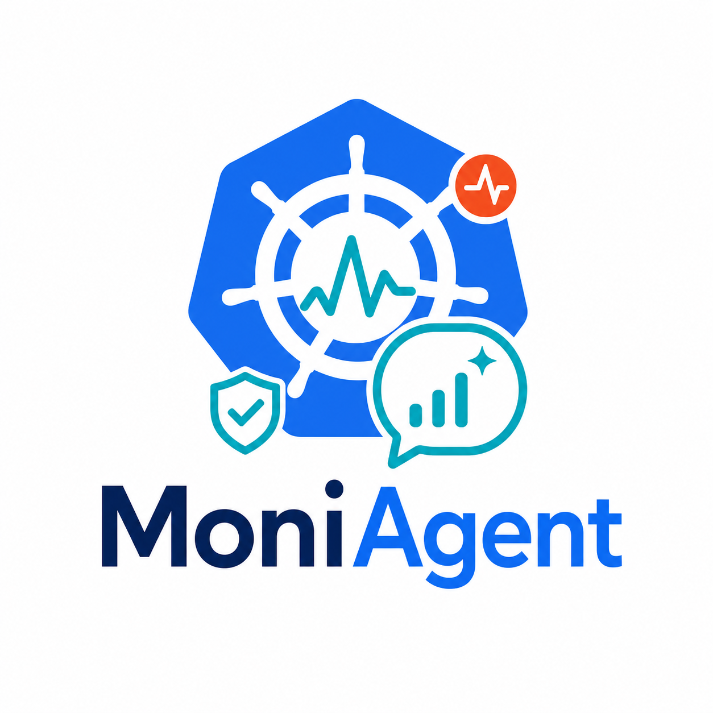

# MoniAgent

<p align="center">
  
</p>

<p align="center">
  
  
  
  
  
  
  
  
</p>

MoniAgent is a read-only AI-powered observability assistant for AKS and Azure
workloads. It collects structured metrics from controlled backend tools,
summarizes cluster health, and turns metric results into clear explanations for
Microsoft Teams and chat users.

Phase 1 focuses on safe observability:

- Daily AKS health reports sent to Microsoft Teams.
- On-demand metric questions through Teams or chat.
- Controlled Prometheus and Azure Monitor queries through whitelisted tools.
- Plain-English explanations, warnings, and read-only investigation guidance.
- No remediation, scaling, rollback, `kubectl` execution, or arbitrary PromQL
  generated by AI.

# Getting Started
Install dependencies:

```bash
pip install -r requirements.txt
```

Configure the service with environment variables or Kubernetes Secrets. Start
from `.env.example` and provide values for Prometheus, Azure Monitor, Teams
webhooks, and auth tokens as needed.

Run the API locally:

```bash
uvicorn metrics_service.app:app --reload
```

# Build and Test
Run tests:

```bash
pytest
```

Build the container image:

```bash
docker build -t moni-agent .
```

Helm deployment templates are available under `k8s-helm/` for the main service,
daily report CronJob, and alert polling CronJob.

# Contribute
Keep Phase 1 behavior read-only. New metric capabilities should use controlled
backend tools, validate user input, apply timeouts and result limits, and avoid
leaking secrets in logs or responses.

Useful project docs:

- [Architecture overview](assets/architecture-overview.md)
- [Alerting setup](assets/alerting/README.md)
- [Database design notes](assets/db/database-design.md)
