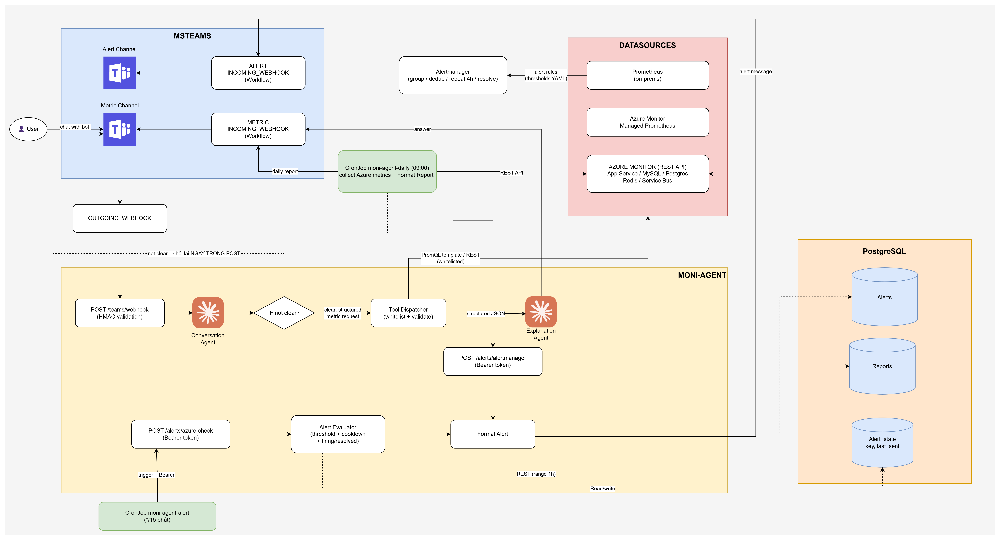

# AI-Powered AKS Metrics Assistant — Phase 1 Report

Phase 1 delivers a **read-only** observability assistant for Azure Kubernetes Service (AKS). It collects metrics, answers on-demand questions in Microsoft Teams, sends a daily health report, and pushes proactive alerts. It performs **no remediation** and never modifies infrastructure.

---

## 1. Architecture Overview



The system is built around one principle: **a single backend service (`moni-agent`) is the only component allowed to query the metric sources.** Claude (the LLM) never touches Prometheus or Azure directly — it only receives structured JSON from controlled backend tools and turns it into plain-English explanations.

```text
Metric Sources (read-only)        moni-agent (FastAPI on AKS)          Microsoft Teams
─────────────────────────         ───────────────────────────         ──────────────────
Prometheus (in-cluster)     ──►   Tool Dispatcher (whitelist)    ──►   Metric Channel (chat)
Azure Monitor Mgd Prom.     ──►   Conversation + Explanation AI         Alert Channel (alerts)
Azure Monitor REST API      ──►   Daily report + Alert engines
```

Four independent flows run on top of this backbone:

| Flow | Trigger | LLM used? | Teams channel |
|---|---|---|---|
| On-demand chat | User message in Teams | Yes (2 agents) | Metric channel |
| Daily report | CronJob `0 2 * * *` (09:00 ICT) | No (rule-based) | Report channel |
| Kubernetes alerts | Alertmanager push | No (rule-based) | Alert channel |
| Azure alerts | CronJob `*/15 * * * *` | No (rule-based) | Alert channel |

PostgreSQL (shown with dashed links in the diagram) is a **future-phase proposal** for alert/report history and durable cooldown — not implemented in Phase 1.

---

## 2. The Backend: `moni-agent`

A FastAPI service deployed to AKS (`metrics_service/app.py`). It is the only Prometheus/Azure client and exposes read-only endpoints grouped by purpose:

- **Metrics** (`/metrics/*`, `/metrics/k8s/*`) — cluster health, node CPU/memory, pod restarts, unhealthy pods, namespace usage, top consumers, service errors, plus cluster-aware workload/service views.
- **Azure Monitor** (`/azure/*`) — App Service, MySQL, PostgreSQL, Redis, and Service Bus performance.
- **Chat** (`/chat`, `/teams/chat`, `/teams/webhook`).
- **Reports & Alerts** (`/daily-report`, `/alerts/alertmanager`, `/alerts/azure-check`).
- **Ops** (`/health`, `/sources`).

Every endpoint validates its inputs (namespace, service, cluster, hostname, range, source) and applies query timeouts and result limits. Prometheus access uses fixed PromQL templates inside the backend — the LLM never supplies PromQL.

---

## 3. On-Demand Chat (Two-Agent Flow)

This is the only flow that uses the LLM. A user @mentions the bot in the Teams **metric channel**; Teams sends an HMAC-signed Outgoing Webhook to `POST /teams/webhook`.

```text
User → Teams → POST /teams/webhook (HMAC validate)
   → Agent 1: Conversation Agent  (Claude — intent → whitelisted tool name, JSON only)
        ├─ needs_clarification / refused → reply immediately in the user's post
        └─ ready → Tool Dispatcher (validate against ALLOWED_TOOL_DISPATCH)
                 → Metric tool (predefined PromQL / REST)
                 → structured JSON
                 → Agent 2: Explanation Agent (Claude — plain-English answer)
                 → Incoming Webhook → answer delivered in Teams
```

**Agent 1 (`conversation_agent.py`)** reads the raw message and returns only a routing decision: `ready`, `needs_clarification`, or `refused`. It never writes PromQL and never calls Prometheus.

**Tool Dispatcher (`tool_dispatcher.py`)** is the security gate: it rejects any tool not on the `ALLOWED_TOOL_DISPATCH` whitelist and validates all arguments before execution.

**Agent 2 (`ai_agent.py → analyze_metrics`)** receives the structured result and the original question, then writes a concise explanation with read-only investigation suggestions only.

**Hybrid latency design:** Teams Outgoing Webhooks have a hard 5-second timeout. Agent 1 runs synchronously within a ~4s budget so clarifications and refusals are returned *inside* the user's post. A full metric answer (5–15s) is acknowledged immediately and the real answer is delivered separately through the Incoming Webhook. If Agent 1 exceeds the budget, the whole flow falls back to the async path.

---

## 4. Daily Health Report

A Kubernetes CronJob (`moni-agent-daily`, schedule `0 2 * * *` UTC = 09:00 Vietnam time) runs `python -m daily_report`.

```text
CronJob → collect_azure_project_metrics() → format_daily_report() → send_daily_report() → Teams Report channel
```

It iterates the production resource groups defined in `prod_projects.py` (`PROD_PROJECTS`) — App Services, MySQL, PostgreSQL, Redis, and Service Bus — via the Azure Monitor tools, then builds the message with a **rule-based formatter (`report_formatter.py`, no LLM)**. Per-resource failures are recorded as nulls and appended to an errors list so one bad resource never aborts the whole report. The report lands in the dedicated **report channel** via its Incoming Webhook (`TEAMS_WEBHOOK_URL`).

---

## 5. Alerting (Two Paths, Rule-Based)

Alerts go to a **dedicated Teams alert channel** (`TEAMS_ALERT_WEBHOOK_URL`), separate from the report channel. No LLM is involved in either path.

**Path A — Kubernetes (push):**

```text
Prometheus alert rules → Alertmanager (group/dedup/repeat 4h/resolve)
   → POST /alerts/alertmanager (Bearer token) → alert_formatter.py → Teams Alert channel
```

Thresholds live only in `prometheus-alert-rules.yaml` (e.g. NodeHighCPU >85%/10m, NodeHighMemory >90%/10m, NodeNotReady 5m critical, PodCrashLooping >3 restarts/15m, ServiceHighErrorRate 5xx >5%). Tuning a value means editing the rule and reloading Prometheus — no service redeploy.

**Path B — Azure resources (poll):**

```text
CronJob moni-agent-alert (*/15 * * * *) → POST /alerts/azure-check (Bearer token)
   → azure_alert_check.py (compare against AZURE_ALERT_* thresholds, range 1h)
   → firing/resolved + cooldown → alert_formatter.py → Teams Alert channel
```

Running the evaluation inside the long-lived service process (rather than in the CronJob pod) lets the firing/resolved cooldown state survive between 15-minute runs. Both alert endpoints require `Authorization: Bearer <ALERT_WEBHOOK_TOKEN>` and fail closed (503) when the token is unset.

---

## 6. Microsoft Teams Integration

Two separate channels, each with its own Incoming Webhook:

- **Metric channel** — interactive chat. Inbound via Outgoing Webhook (HMAC-validated `/teams/webhook`); answers returned in-thread or via Incoming Webhook.
- **Report & Alert channels** — outbound only. Daily reports and alert cards posted via Incoming Webhooks (`teams_sender.py`).

Messages are formatted to be human-readable (cards, summaries) — users never see raw JSON, and no secrets, label dumps, internal URLs, or stack traces appear in any message.

---

## 7. Security & Phase 1 Boundaries

- Prometheus stays private; the LLM cannot execute arbitrary PromQL.
- Read-only access only — no pod restarts, scaling, rollbacks, CI/CD triggers, or `kubectl` actions.
- All user inputs validated; query timeouts and result-size limits applied.
- Secrets stored in environment variables / Kubernetes Secrets; never logged or echoed.
- Out-of-scope requests (remediation, etc.) are refused by Agent 1 and redirected to read-only guidance.

---

## 8. Deployment

Both workloads ship from the same image (`moni-agent`) via Azure DevOps pipelines (`azure-pipelines/`):

- `pipelines.deployment.moni-agent.yaml` — the long-running FastAPI service (Deployment).
- `pipelines.deployment.moni-agent-daily.yaml` — the daily report CronJob.

Helm charts (`moni-agent` for the service, `moni-agent-daily` for the report CronJob) template the deployment, cronjob, service, and tokenized secret values. The Azure alert poll runs as a `moni-agent-alert` CronJob (`*/15`) referenced in the alerting docs.

---

## 9. Future Phases

Designed for extension without implementing it now: AI remediation **suggestions** (with approval), incident ticket creation, rollback workflows, CI/CD triggering, n8n orchestration, and a PostgreSQL store for alert history, report history, and durable cooldown state. Backend tool contracts stay stable so future callers (including n8n) can reuse them.
