# Sơ đồ kiến trúc tổng thể — AI-powered Metrics Assistant (Phase 1 + PostgreSQL)

> 4 luồng: Chat hỏi đáp (2-agent AI) · Daily report (rule-based) · Alert Kubernetes (Alertmanager push) · Alert Azure (CronJob poll 15') — và PostgreSQL (đề xuất) làm tầng lưu trữ chung.

```mermaid
flowchart LR
    %% ===== USERS & TEAMS =====
    User((User))
    subgraph TEAMS["Microsoft Teams"]
        ChatBot["MS Teams Chatbot"]
        ReportChannel["📄 Report Channel<br/>(TEAMS_WEBHOOK_URL)"]
        AlertChannel["🚨 Alert Channel<br/>(TEAMS_ALERT_WEBHOOK_URL)"]
    end

    %% ===== METRICS SERVICE =====
    subgraph SVC["Metrics Service — moni-agent (FastAPI, AKS)"]
        TeamsWebhook["POST /teams/webhook<br/>(HMAC validate)"]
        Agent1["🤖 Agent 1: Conversation Agent<br/>(Claude — hiểu ý định, chọn tool)"]
        Clarify{"If not clear"}
        Dispatcher["Tool Dispatcher<br/>(whitelist ALLOWED_TOOL_DISPATCH,<br/>validate input)"]
        Agent2["🤖 Agent 2: Explanation Agent<br/>(Claude — giải thích kết quả)"]
        AMWebhook["POST /alerts/alertmanager<br/>(Bearer token)"]
        AzCheck["POST /alerts/azure-check<br/>(Bearer token)"]
        AzEval["azure_alert_check.py<br/>(so ngưỡng AZURE_ALERT_*,<br/>cooldown 4h, firing/resolved)"]
        AlertFmt["alert_formatter.py<br/>(rule-based, NO LLM)"]
        DailyFmt["report_formatter.py<br/>(rule-based, NO LLM)"]
    end

    %% ===== DATASOURCES =====
    subgraph DS["Metric Sources (read-only)"]
        PromNode["Prometheus<br/>(in-cluster)"]
        PromAKS["Azure Monitor<br/>Managed Prometheus"]
        AzMon["Azure Monitor REST API<br/>(App Service, MySQL, Postgres,<br/>Redis, Service Bus — PROD_PROJECTS)"]
    end

    %% ===== ALERTING (K8S) =====
    subgraph K8SALERT["Kubernetes Alerting"]
        Rules["prometheus-alert-rules.yaml<br/>(ngưỡng: CPU 85, Mem 90, Disk 85,<br/>NotReady, CrashLoop, 5xx 5%)"]
        AM["Alertmanager<br/>(group / dedup / repeat 4h / resolve)"]
    end

    %% ===== CRONJOBS =====
    CronDaily["⏰ CronJob moni-agent-daily<br/>(0 2 * * *)"]
    CronAlert["⏰ CronJob moni-agent-alert<br/>(*/15 * * * *)"]

    %% ===== POSTGRES (PROPOSED) =====
    subgraph PG["🐘 PostgreSQL — Azure Flexible Server B1ms (đề xuất)"]
        TAlerts[("alerts<br/>id, source, alertname, severity,<br/>project, resource, status,<br/>value, threshold, payload JSONB")]
        TReports[("reports<br/>report_date, type,<br/>content, meta JSONB")]
        TState[("alert_state<br/>key, last_sent<br/>(cooldown bền vững)")]
    end

    %% ===== FLOW 1: CHAT =====
    User -->|"hỏi metric"| ChatBot
    ChatBot -->|"Outgoing Webhook (HMAC)"| TeamsWebhook
    TeamsWebhook --> Agent1
    Agent1 --> Clarify
    Clarify -->|"hỏi lại NGAY TRONG POST<br/>(HTTP response của Outgoing Webhook, <5s)"| ChatBot
    Clarify -->|"structured metric request"| Dispatcher
    Dispatcher -->|"PromQL template"| PromNode
    Dispatcher -->|"PromQL template"| PromAKS
    Dispatcher -->|"REST query"| AzMon
    Dispatcher -->|"structured JSON"| Agent2
    Agent2 -->|"Incoming Webhook"| ChatBot

    %% ===== FLOW 2: DAILY REPORT =====
    CronDaily -->|"python -m daily_report"| AzMon
    AzMon --> DailyFmt
    DailyFmt -->|"Incoming Webhook"| ReportChannel

    %% ===== FLOW 3: K8S ALERTS =====
    PromNode -.->|"đánh giá rule"| Rules
    Rules --> AM
    AM -->|"webhook + Bearer"| AMWebhook
    AMWebhook --> AlertFmt

    %% ===== FLOW 4: AZURE POLL ALERTS =====
    CronAlert -->|"trigger + Bearer"| AzCheck
    AzCheck --> AzEval
    AzEval -->|"query (range 1h)"| AzMon
    AzEval --> AlertFmt
    AlertFmt -->|"Incoming Webhook"| AlertChannel

    %% ===== POSTGRES LINKS (PLANNED) =====
    AlertFmt -.->|"lưu alert"| TAlerts
    DailyFmt -.->|"lưu report"| TReports
    AzEval -.->|"đọc/ghi cooldown"| TState
    Dispatcher -.->|"tool get_recent_alerts (tương lai)"| TAlerts

    %% ===== STYLE =====
    style Agent1 fill:#D97757,color:#fff
    style Agent2 fill:#D97757,color:#fff
    style AlertFmt fill:#e8f5e9
    style DailyFmt fill:#e8f5e9
    style PromNode fill:#ffcdd2
    style PromAKS fill:#ffcdd2
    style AzMon fill:#bbdefb
    style PG fill:#fff3e0
    style AlertChannel fill:#ffebee
    style ReportChannel fill:#e3f2fd
```

## Ghi chú

- **Nét liền** = đã triển khai; **nét đứt từ/đến PostgreSQL** = đề xuất tương lai (alert history, report history, cooldown bền vững).
- **Chat hybrid:** câu hỏi lại / từ chối trả NGAY TRONG POST qua HTTP response của Outgoing Webhook (Agent 1 quyết định trong ≤4s); câu trả lời metric đầy đủ (5–15s) trả qua Incoming Webhook (Workflow). Nếu Agent 1 chậm quá 4s → fallback: mọi thứ về qua Workflow.
- LLM (Claude) **chỉ** xuất hiện ở luồng chat (Agent 1 + Agent 2). Daily report và cả 2 luồng alert đều rule-based để tiết kiệm chi phí.
- 2 channel Teams tách biệt: report channel và alert channel, mỗi channel một Incoming Webhook riêng.
- Toàn bộ Phase 1 read-only: không remediation, không sửa tài nguyên Kubernetes/Azure.
- Ngưỡng alert K8s nằm trong `prometheus-alert-rules.yaml` (Prometheus đánh giá); ngưỡng Azure nằm trong env `AZURE_ALERT_*` (service đánh giá).
