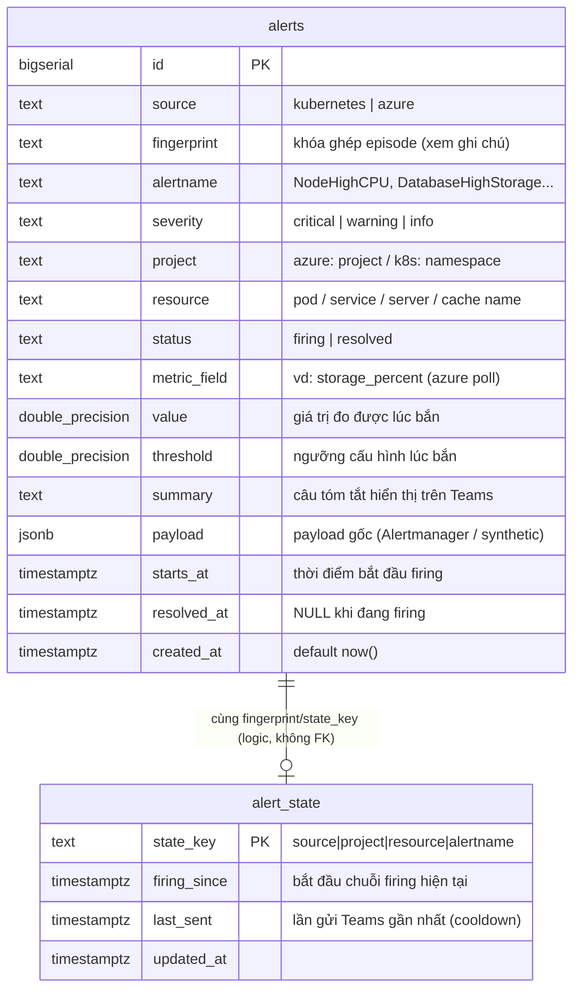

# Thiết kế Database — moni-agent (PostgreSQL in-cluster)

> Phạm vi: lưu **alerts** + **alert_state** (cooldown bền vững), phục vụ tool chat `get_recent_alerts` và mục **"Alerts trong 24h qua"** trong daily report.
>
> Nguyên tắc: DB là tầng phụ — **mọi thao tác ghi là best-effort**; DB chết thì alert vẫn ra Teams, cooldown fallback về in-memory.

## Sơ đồ ERD



Không có foreign key thật giữa 2 bảng — `alert_state` là bảng vận hành (mutable, xoá khi resolved), `alerts` là sổ cái lịch sử (append + update resolved_at). Liên kết bằng quy ước key.

## DDL khởi tạo

```sql
-- Chạy lúc service khởi động (CREATE IF NOT EXISTS, chưa cần Alembic)

CREATE TABLE IF NOT EXISTS alerts (
    id            BIGSERIAL PRIMARY KEY,
    source        TEXT NOT NULL CHECK (source IN ('kubernetes', 'azure')),
    fingerprint   TEXT NOT NULL,
    alertname     TEXT NOT NULL,
    severity      TEXT NOT NULL DEFAULT 'warning',
    project       TEXT,
    resource      TEXT,
    status        TEXT NOT NULL CHECK (status IN ('firing', 'resolved')),
    metric_field  TEXT,
    value         DOUBLE PRECISION,
    threshold     DOUBLE PRECISION,
    summary       TEXT,
    payload       JSONB,
    starts_at     TIMESTAMPTZ NOT NULL,
    resolved_at   TIMESTAMPTZ,
    created_at    TIMESTAMPTZ NOT NULL DEFAULT now()
);

-- Mỗi "episode" (fingerprint) chỉ có 1 dòng đang firing
CREATE UNIQUE INDEX IF NOT EXISTS uq_alerts_open_episode
    ON alerts (fingerprint) WHERE resolved_at IS NULL;

-- get_recent_alerts + mục daily "alerts 24h qua": quét theo thời gian
CREATE INDEX IF NOT EXISTS idx_alerts_created_at
    ON alerts (created_at DESC);

-- Lọc nhanh "đang firing"
CREATE INDEX IF NOT EXISTS idx_alerts_firing
    ON alerts (status) WHERE status = 'firing';

-- Truy vết lịch sử một resource/alert cụ thể
CREATE INDEX IF NOT EXISTS idx_alerts_name_resource
    ON alerts (alertname, resource, created_at DESC);

-- Query ad-hoc vào payload (tương lai)
CREATE INDEX IF NOT EXISTS idx_alerts_payload_gin
    ON alerts USING gin (payload);


CREATE TABLE IF NOT EXISTS alert_state (
    state_key     TEXT PRIMARY KEY,
    firing_since  TIMESTAMPTZ NOT NULL,
    last_sent     TIMESTAMPTZ NOT NULL,
    updated_at    TIMESTAMPTZ NOT NULL DEFAULT now()
);
```

## Quy ước khóa

| Khóa | Công thức | Ví dụ |
|---|---|---|
| `fingerprint` (k8s) | lấy thẳng `fingerprint` Alertmanager gửi kèm | `7d3b8e1f9a2c` |
| `fingerprint` (azure) | `azure\|{project}\|{resource}\|{alertname}` | `azure\|WMT\|wmt-mysql-prod-sa\|DatabaseHighStorage` |
| `state_key` | `{source}\|{project}\|{resource}\|{alertname}` | `azure\|WMT\|wmt-mysql-prod-sa\|DatabaseHighStorage` |

## Vòng đời một alert (episode model)

```text
FIRING lần đầu    → INSERT alerts (status=firing, resolved_at=NULL)
                    UPSERT alert_state (firing_since=now, last_sent=now)
Còn firing,       → không ghi gì thêm vào alerts
trong cooldown      (alert_state.last_sent giữ nguyên)
Còn firing,       → UPDATE alert_state.last_sent = now
hết cooldown 4h     (vẫn KHÔNG insert dòng alerts mới — 1 episode 1 dòng)
RESOLVED          → UPDATE alerts SET status='resolved', resolved_at=now
                    WHERE fingerprint=? AND resolved_at IS NULL
                    DELETE FROM alert_state WHERE state_key=?
```

→ Mỗi dòng `alerts` = một **episode** trọn vẹn (từ lúc bắn tới lúc hồi phục), có `duration = resolved_at - starts_at`. Đếm, thống kê, không bị trùng.

## Ai đọc / ai ghi

```text
GHI:
  POST /alerts/alertmanager  → insert/resolve episode (source=kubernetes)
  Alert Evaluator (azure)    → insert/resolve episode (source=azure)
                             → đọc/ghi alert_state (cooldown — thay in-memory dict)
ĐỌC:
  Tool chat get_recent_alerts(hours, severity?, status?)   ← whitelist thêm vào ALLOWED_TOOL_DISPATCH
  Daily report "Alerts trong 24h qua"                      ← CronJob daily (pod riêng, cần DATABASE_URL)
```

## Query mẫu cho 2 consumer

```sql
-- get_recent_alerts(hours=24, severity=NULL, status=NULL), giới hạn kết quả
SELECT alertname, severity, source, project, resource, status,
       value, threshold, summary, starts_at, resolved_at
FROM alerts
WHERE created_at > now() - make_interval(hours => $1)
  AND ($2::text IS NULL OR severity = $2)
  AND ($3::text IS NULL OR status = $3)
ORDER BY created_at DESC
LIMIT 50;

-- Daily report: tổng quan 24h
SELECT severity,
       count(*)                                   AS episodes,
       count(*) FILTER (WHERE resolved_at IS NULL) AS still_firing
FROM alerts
WHERE created_at > now() - interval '24 hours'
GROUP BY severity;

-- Daily report: top alert lặp nhiều nhất 24h
SELECT alertname, resource, count(*) AS times
FROM alerts
WHERE created_at > now() - interval '24 hours'
GROUP BY alertname, resource
ORDER BY times DESC
LIMIT 5;
```

## Retention

Xoá episode cũ hơn `ALERT_RETENTION_DAYS` (mặc định 90, env-tunable), chạy ghé trong CronJob daily:

```sql
DELETE FROM alerts WHERE created_at < now() - make_interval(days => $1);
```

Ước lượng dung lượng: ~50 episode/ngày × ~2KB (kèm JSONB) × 90 ngày ≈ **9 MB** — PVC 5Gi dư rất nhiều năm.

## Kết nối từ code (sau này implement)

- `DATABASE_URL` từ Secret `moni-agent-db-secret` (đã có trong YAML deploy).
- SQLAlchemy 2.0; test dùng SQLite in-memory (đổi URL).
- Mọi hàm storage bọc try/except: lỗi DB → log warning, flow chính tiếp tục.
- Cooldown: đọc `alert_state` đầu cycle; nếu DB lỗi → dùng in-memory dict như hiện tại.
```
